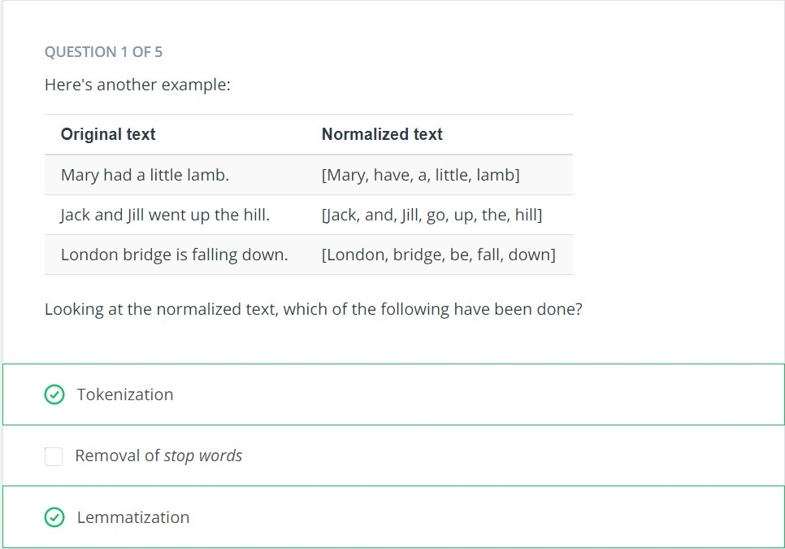

## Text Data
Text is another example of a data type that is initially non-numerical and that must be processed before it can be fed into a machine learning algorithm. Let's have a look at some of the common tasks we might do as part of this processing.

**Normalization**

Text normalization is the process of transforming a piece of text into a canonical (official) form.
Lemmatization is an example of normalization. A lemma is the dictionary form of a word and lemmatization is the process of reducing multiple inflections to that single dictionary form. 

**Vectorization**

The goal here is to identify the particular features of the text that will be relevant to us for the particular task we want to perform—and then get those features extracted in a numerical form that is accessible to the machine learning algorithm
Remember, a vector is simply an array of numbers—so there are many different ways that we can vectorize a word or a sentence, depending on how we want to use it.

**Feature Extraction**

As we talked about earlier, the text in the example can be represented by vectors with length 6 since there are 6 words total.

[quick, fox] as (0.32, 0.23, 0.0, 0.0, 0.0, 0.0)

[lazy, dog] as (0.0, 0.0, 0.12, 0.23, 0.0, 0.0)

[rabid, hare] as (0.0, 0.0, 0.0 , 0.0, 0.56, 0.12)

We understand the text because each word has a meaning. But how do algorithms understand the text using the vectors, in other words, how do algorithms extract features from the vectors?

Vectors with length n can be visualized as a line in an n dimension space. For example, a vector (1,1) can be viewed as a line starting from (0, 0) and ending at (1,1).

Any vector with the same length can be visualized in the same space. How close one vector is to another can be calculated as vector distance. If two vectors are close to each other, we can say the text represented by the two vectors have a similar meaning or have some connections. For example, if we add [lazy, fox] to our example:

|            |quick	 | fox	|lazy	|dog	|rabid|	hare|
|-------------|------|------|------|----|-----|-----|
|[quick, fox]	|0.32|	0.23	|0.0	|0.0|	0.0	|0.0|
|[lazy, dog]	|0.0	|0.0	|0.12|	0.23	|0.0|	0.0|
|[rabid, hare]	|0.0|	0.0	|0.0|	0.0	|0.56	|0.12|
|[lazy, fox]	|0.0	|0.23	|0.12|	0.0|	0.0	|0.0|

Apparently, [lazy, fox] is more similar to [lazy, dog] than [rabid, hare], so the vector distance of [lazy, fox] and [lazy, dog] is smaller than that to [lazy, fox] and [rabid, hare].

**The Whole Pipeline**

The next step is feature extraction and vectorization, which creates a numeric representation of the documents. Common approaches include TF-IDF vectorization, Word2vec, and Global Vectors (GloVe).

