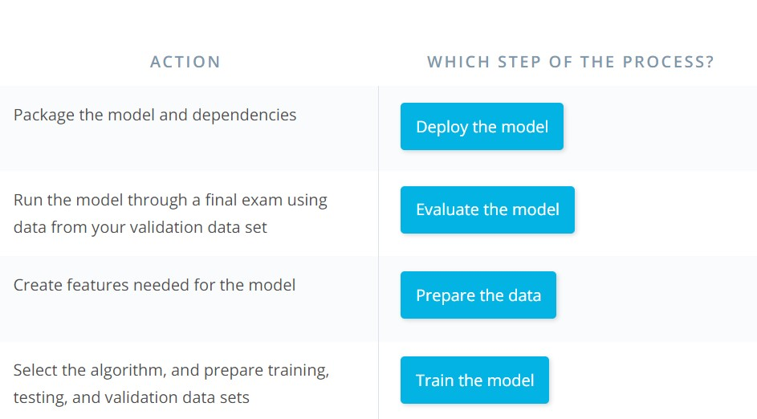
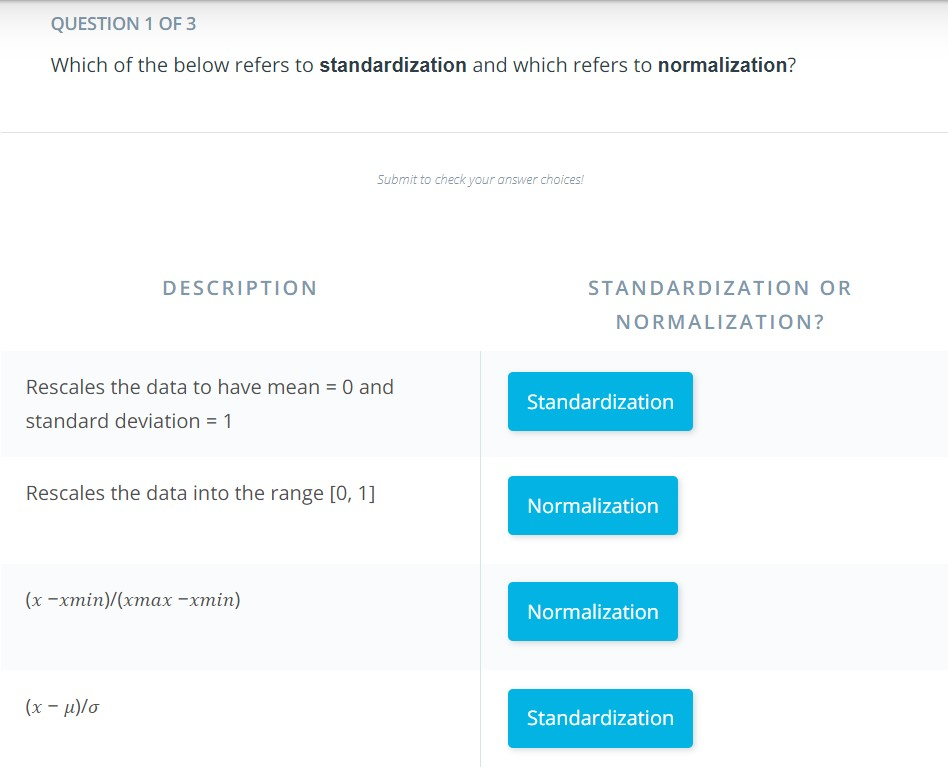

## What is Machine Learning?
Machine learning is a data science technique used to extract patterns from data, allowing computers to identify related data, and forecast future outcomes, behaviors, and trends.

## Applications of Machine Learning
Applications of Machine Learning

Natural Language processing
computer vision
Analytics
Decision Making Example of ML
Automating the recognisation of disease Recommend next best actions for individual care plan Enabling personailze real time banking experience with chat bots Identifying next best action for the customer

**Examples of Applied Machine Learning** 

- [ ] Automate the recognition of disease Trained physicians can only review and evaluate a limited volume of patients or patient images (X-rays, sonograms, etc.). Machine learning can be used to spot the disease, hence reducing physician burnout. For example, Google has trained a deep learning model to detect breast cancer and Stanford researchers have used deep learning models to diagnose skin cancer.

- [ ] Recommend next best actions for individual care plans With the mass digitization of patient data via systems that use EMRs (Electronic Medical Records) and EHRs (Electronic Health Records), machine learning can be used to help build effective individual care plans. For example, IBM Watson Oncology can help clinicians explore potential treatment options. More examples of how machine learning impacts healthcare can be found here.

- [ ] Enable personalized, real-time banking experiences with chatbots You've likely encountered this when you call a customer service number. Machine learning can be used to intercept and handle common, straightforward issues through chat and messaging services, so customers can quickly and independently resolve simple issues that would otherwise have required human intervention. With the chatbot, a customer can simply type in a question and the bot engages to surface the answer. Refer to this article to find more information about chatbot powered machine learning.

- [ ]  Identify the next best action for the customer Real-time insights that incorporate machine learning tools—such as sentiment analysis—can help organizations assess the likelihood of a deal closing or the level of a customer’s loyalty. Personally-tailored recommendations powered by machine learning can engage and delight customers with information and offers that are relevant to them.

- [ ] Capture, prioritize, and route service requests to the correct employee, and improve response times A busy government organization gets innumerable service requests on an annual basis. Machine learning tools can help to capture incoming service requests, to route them to the correct employee in real-time, to refine prioritization, and improve response times. Can check out this article if you're curious to learn more about ticket routing

## Brief History of Machine Learning
in 50's the AI was an emerging feild wher the main fous was to copy the way the human think and act Artificial intelligence --> machine learning --> deep learning For more detail about What’s the Difference Between Artificial Intelligence, Machine Learning and Deep Learning? https://blogs.nvidia.com/blog/2016/07/29/whats-difference-artificial-intelligence-machine-learning-deep-learning-ai/

## The Data Science Process
Big data has become the essiential part of any organisation.Raw data is often noisy and unreliable and may contain missing values and outliers.Using such data for modeling can lead to wrong or bad results. for data scientist the ability to combine large, disparate data sets into a format more appropirate for analysis.

- [ ]  Step 1 is collecting data (Write code)
- [ ]  Step 2 Prepare Data (write queries and code)
- [ ]  Step 3 Train Model(write code Do dome math) - [ ] Step 4 Evaluate Model(write code Do dome math)
- [ ]  Step 5 Deploy Model(Devops)
- [ ]  Step 6 is retraing the model as the surrounding enviroment chenges the retraanning also becomes essiential part and yes it is an iterative step in production

## Common Types of Data

- [ ] Numerical
- [ ] Time Series 
- [ ] Categorical
- [ ] Text 
- [ ] Image

## Tabular Data
In machine learning, the most common type of data you'll encounter is tabular data—that is, data that is arranged in a data table. This is essentially the same format as you work with when you look at data in a spreadsheet.

Here's an example of tabular data showing some different clothing products and their properties:
| SKU	   | Make        | Color | Quantity | Price|
| -------| ----------- |-------| -------- |------|
| 908721 | Guess       | Blue  | 789      |45.33 |
| 456552 | Text        | Red   | 22.91    |22.91 |
| 789921 | A&F	       | Green | 387	    |25.92 |
| 872266 | Guess       | Blue  | 154	    |17.56 |

## Vectors
It is important to know that in machine learning we ultimately always work with numbers or specifically vectors.
A vector is simply an array of numbers, such as (1, 2, 3)—or a nested array that contains other arrays of numbers, such as (1, 2, (1, 2, 3)).

Vectors are used heavily in machine learning. If you have taken a basic course in linear algebra, then you are probably in good shape to begin learning about how they are used in machine learning. 

All non-numerical data types (such as images, text, and categories) must eventually be represented as numbers
In machine learning, the numerical representation will be in the form of an array of numbers—that is, a vector
As we go through this course, we'll look at some different ways to take non-numerical data and vectorize it (that is, transform it into vector form).

## Scaling Data
Scaling data means transforming it so that the values fit within some range or scale, such as 0–100 or 0–1. There are a number of reasons why it is a good idea to scale your data before feeding it into a machine learning algorithm.

Let's consider an example. Imagine you have an image represented as a set of RGB values ranging from 0 to 255. We can scale the range of the values from 0–255 down to a range of 0–1. This scaling process will not affect the algorithm output since every value is scaled in the same way. But it can speed up the training process, because now the algorithm only needs to handle numbers less than or equal to 1.

Two common approaches to scaling data include standardization and normalization.
**Standardization**
Standardization rescales data so that it has a mean of 0 and a standard deviation of 1.

The formula for this is:

(𝑥 − 𝜇)/𝜎
**Normalization**
Normalization rescales the data into the range [0, 1].

The formula for this is:

(𝑥 −𝑥𝑚𝑖𝑛)/(𝑥𝑚𝑎𝑥 −𝑥𝑚𝑖𝑛)

